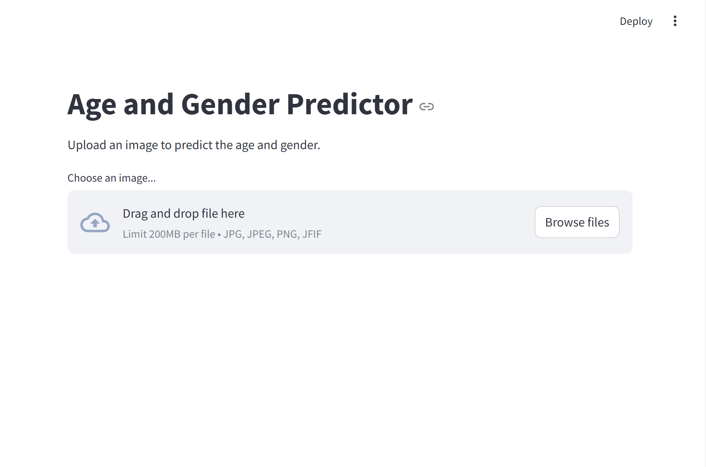

1. # Project Name

Age Gender Detector

## Table of Contents

1. [Overview](#overview)
2. [Installation](#installation)
3. [Run](#run)


## Overview
The Age and Gender Detector is a deep learning project designed to accurately predict the age and gender of individuals from images. Leveraging a convolutional neural network (CNN), this model analyzes facial features to provide reliable estimations.

## Installation

Step-by-step instructions on how to set up the environment and install the necessary dependencies.

```bash
# Clone the repository
git clone [https://github.com/username/repository-name.git](https://github.com/9650ro85hit/age_gender_detector.git)

# Navigate into the project directory
cd repository-name

# Create a virtual environment (optional but recommended)
python -m venv venv
source venv/bin/activate  # On Windows use `venv\Scripts\activate`

# Install required packages
pip install -r requirements.txt


## run
After installation of all nessesary librearies..
Run #steamlit run main.py in terminal.
You will get User Interface like 
```bash
Upload an Image and press predict button to see the result..

